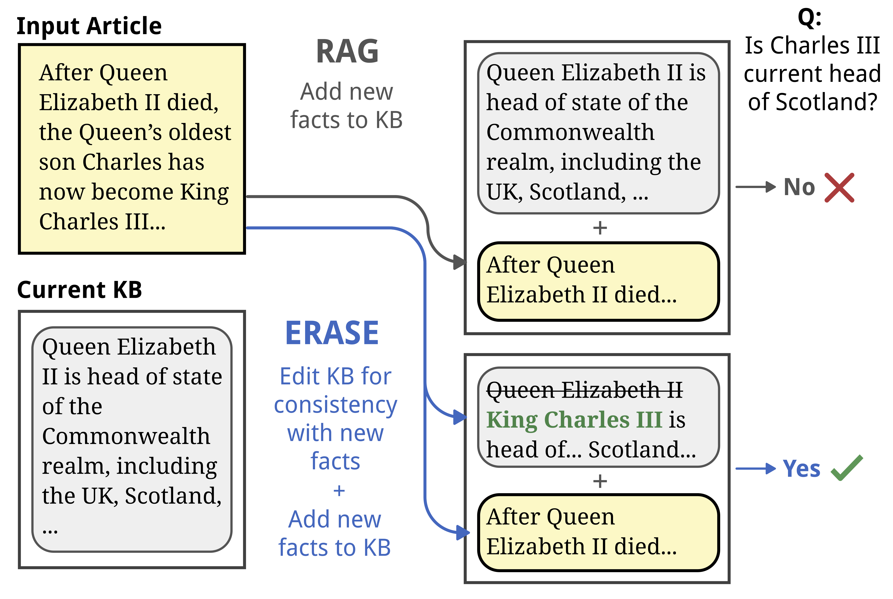
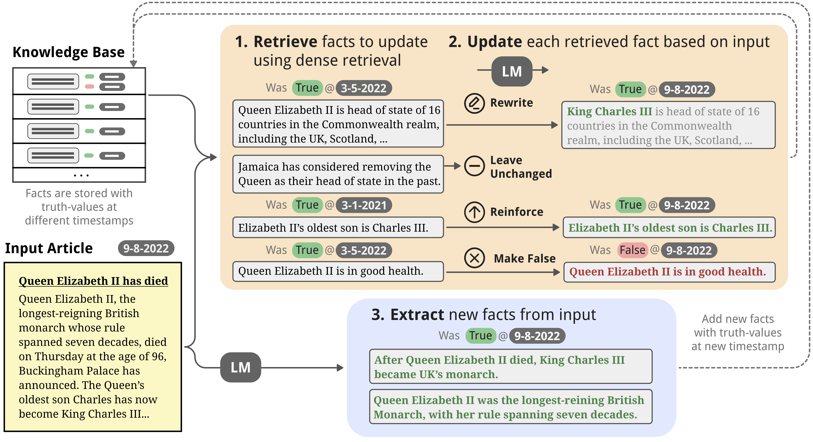

# ERASE
Code and Data for [Language Modeling with Editable External Knowledge](https://arxiv.org/html/2406.11830v1).

<!-- insert image -->



## Setup
To setup your environment, run:
```bash
conda create -n mem_rewrite PYTHON=3.11
conda activate mem_rewrite

# get pytorch with a version of CUDA compatible with your machine
conda install pytorch pytorch-cuda=12.1 -c pytorch -c nvidia

# install other requirements
bash setup.sh
```


## Run ERASE


To run Mixtral, set your TogetherAI API token
```bash
export TOGETHER_API_KEY=<TOGETHER_API_KEY>
```

Set your OpenAI API token if you wish to run GPT* models
```bash
export OPENAI_API_KEY=<OPENAI_API_KEY>
```

To run ERASE on the CLARK-News dataset, use:
```bash
python lm_eval.py \
    --dataset news \
    --datapath CLARK_news/ \
    (--model_name [mistralai/Mixtral-8x7B-Instruct-v0.1|meta-llama/Llama-3-8b-chat-hf]) \
    (--local_model_path <local_model_fp> \)
    --context_length [2048|4096] \
    --save_as_facts \
    --retrieve_facts similarity \
    (--overwrite_facts similarity --edit_hops 1)
```

* `--model_name` sets the model name for querying the TogetherAI API (for open-source models) or OpenAI API (for GPT* models). If this flag is set, queries the respective API for model inference. Otherwise, queries a local model.
* `--local_model_path` sets the filepath if we want to use a local copy of a Huggingface Instruct model. One of `--model_name` or `--local_model_path` must be set.
* `--context_length` sets the context window of the model
* `--save_as_facts` toggles saving the entries to the KB as facts (rather than as passages)
* `--retrieve_facts` sets how we want to retrieve KB entries. Set it to `similarity` for dense retrieval. To turn off retrieval, do not include this flag. 
* `--overwrite_facts` toggles updating existing KB entries according to new documents. Set it to `similarity` to use dense retrieval to retrieve facts to update. To turn off updating behavior, do not include this flag. 
* `--edit_hops` sets how many "hops" of retrieval we want to performing when updating existing entries. For each edit_hops > 1, the retriever will perform another round of retrieval based on similarity to the facts retrieved from the last round. This is set to 1 by default.


## CLARK Data [WIP]


### CLARK-News
The CLARK-News dataset is available under `CLARK_news`.

If you want to collect more data, you may run our data collection process:

1. Get Wikidata triples that change over time
```bash
python script/get_wikidata_triples.py --data_dir <output_dir>
```
This saves the final triples to `<output_dir>/property_to_results.csv`.

2. Get candidate sources for fact from Google
```bash
python script/extract_queries.py \
    --source_csv <csv_of_wikidata_triples> \
    --target_csv <csv_with_candidate_sources>
```
where `csv_of_wikidata_triples` is the filepath to the CSV file from step 1.
This populates `csv_with_candidate_sources` with a list of candidate sources from Google.

3. Get human-validated annotations (launch annotation interface):
```bash
python AnnotationInterface/webserver.py \
    --source_file <csv_with_candidate_sources> \
    --target_file <csv_with_human_validated_sources> \
    --download_date <download_date>
```
where `csv_with_candidate_sources` is the filepath to the CSV file from step 2.
This populates `csv_with_human_validated_sources` with human annotations.
`download_date` is the date that step 2 was run, in the YYYY-MM-DD. This is needed to infer the origin date of articles mined from Google.

4. Pull text of sources from links:
```bash
python script/pull_external_sources.py \
    --edits_file <csv_with_human_validated_sources> \
    --output_dir <output_dir_of_sources>
```

5. Automated validation of round 1 annotations:
```bash
python script/check_annotations.py  # display annotations in annotations.html
```

6. Second round of human annotation to validate round 1 (launch checking interface):
```bash
python CheckInterface/webserver.py
```

7. Make questions from wikidata relations

```bash
python script/generate_wikidata_questions.py \
    --wikidata_csv <csv_with_human_validated_sources> \
    --output_dir <qs_output_dir>
```


### CLARK-Conversations
Coming soon.

## Cite
To cite this work, you may use the following BibTex entry:
```
@misc{li2024language,
      title={Language Modeling with Editable External Knowledge}, 
      author={Belinda Z. Li and Emmy Liu and Alexis Ross and Abbas Zeitoun and Graham Neubig and Jacob Andreas},
      year={2024},
      eprint={2406.11830},
      archivePrefix={arXiv},
}
```